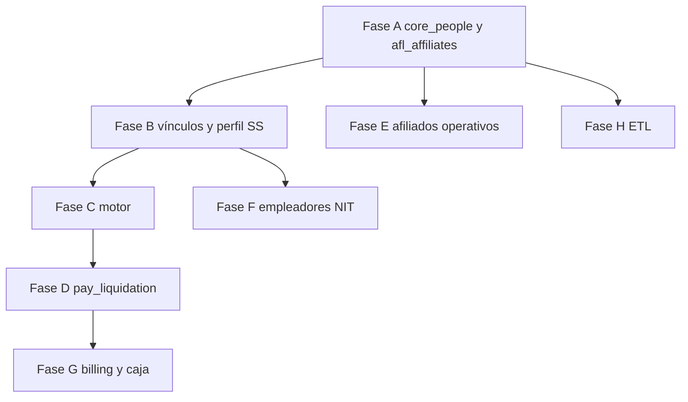

# Plan de mitigación — alineación a documentos guía (Serviconli)

Este documento complementa el plan de estricto cumplimiento respecto a [DOCUMENTO_RECTOR_DEFINITIVO_V5_COMPLETO.md](DOCUMENTO_RECTOR_DEFINITIVO_V5_COMPLETO.md), [REQUISITOS_FUNCIONALES_SERVICONLI.md](REQUISITOS_FUNCIONALES_SERVICONLI.md), [LISTADO_FUNCIONALIDADES_SERVICONLI.md](LISTADO_FUNCIONALIDADES_SERVICONLI.md), [ESTRUCTURA_PROYECTO_SERVICONLI.md](ESTRUCTURA_PROYECTO_SERVICONLI.md) y [SKILL.md](SKILL.md). No sustituye la aprobación de negocio para cambios no escritos en esos documentos.

---

## 1. Situación a mitigar

| ID | Riesgo | Descripción |
|----|--------|-------------|
| R1 | Inconsistencia BD vs código | Migraciones hacia `core_people` / `afl_affiliates` y eliminación de `affiliates` sin modelos y API actualizados pueden romper la aplicación al ejecutar `php artisan migrate`. |
| R2 | Alcance incompleto | Fases posteriores al modelo de personas/afiliados (perfil SS, motor completo, liquidación producto, ETL, etc.) pueden quedar desalineadas si no se cierran por dependencias. |
| R3 | Paridad con Excel/Access | Sin reglas de ETL y tests de regresión alineados al SKILL, existe riesgo de desviación numérica y operativa frente al legado. |
| R4 | Trazabilidad y convenciones | Sin matriz RF × estado y sin revisión de reglas en `cursor-serviconli-rules` por fase, se pierde control de cumplimiento y consistencia de implementación. |

---

## 2. Principios operativos (heredados del plan de cumplimiento)

1. **Fuente de verdad:** Diseño y comportamiento deben citar sección explícita del DOCUMENTO_RECTOR y, si aplica, RF. Lo que no esté en los documentos no se implementa sin aprobación y actualización documental.
2. **Trazabilidad:** Migraciones y reglas de negocio nuevas incluyen comentarios `// DOCUMENTO_RECTOR §X` o `// RF-XXX` donde corresponda.
3. **Reglas Cursor:** Antes de implementar cada fase, revisar reglas en **`cursor-serviconli-rules`** que toquen el mismo dominio.
4. **No regresión:** Los tests existentes del motor (`tests/Unit/Modules/RegulatoryEngine/`, `tests/Feature/RegulatoryEngine/`) deben seguir pasando; nuevas suites para lo agregado.

---

## 3. Acciones de mitigación (orden sugerido)

### 3.1 Bloque A — Estabilizar modelo personas y afiliados (prioridad máxima)

**Mitiga:** R1.

- Completar modelos Eloquent `Person` y `Affiliate` sobre `core_people` y `afl_affiliates` con relaciones bidireccionales.
- Actualizar controladores y validaciones (idealmente Requests/Resources según ESTRUCTURA) para que no referencien la tabla `affiliates` eliminada.
- Actualizar tests de API/feature de afiliados y referencias en PILA liquidación.
- **Despliegue:** no aplicar migraciones que eliminen `affiliates` en producción hasta que el release incluya el código alineado; si aplica, documentar ventana de mantenimiento o rollback.

### 3.2 Bloque B — Perfil de seguridad social versionado y vínculos cotizante–pagador

**Mitiga:** R2 (preparación de dominios dependientes).

- Tablas y modelos según DOCUMENTO_RECTOR §4 (`afl_affiliate_payer`, `afl_social_security_profiles` con vigencias).
- Servicio mínimo de lectura de perfil vigente a una fecha; pruebas de vigencia temporal (RF-028 / RF-029).

### 3.3 Bloque C — Motor normativo

**Mitiga:** R2, R3.

- Cerrar brecha entre §3.1 del rector y el servicio de cálculo PILA (servicios auxiliares y/o strategies, tasas desde `cfg_*`).
- Ampliar tests de regresión con casos documentados sin romper suites existentes.

### 3.4 Bloque D — Liquidación producto

**Mitiga:** R2.

- Persistencia alineada a `pay_liquidation_*` según rector §4 Grupo D, o mapeo explícito documentado desde `pila_liquidations`.
- Comandos Artisan del rector (`pila:*`) como stubs o implementación mínima con contrato estable.

### 3.5 Bloques E–G — Afiliados operativos, empleadores, facturación y caja

**Mitiga:** R2.

- Backend y contratos API primero (wizard, ficha 360°, notas, beneficiarios, “Mis Afiliados” según RF §1 y LISTADO).
- Módulo empleadores y validación NIT (RF-024–027).
- Billing, conciliación de caja y política de seguridad según BC y ESTRUCTURA.

### 3.6 Bloque H — ETL

**Mitiga:** R3.

- Comandos `etl:migrate-excel` y `etl:migrate-access` con mapeo 1:1 a hojas acordadas en SKILL; no inventar columnas.

### 3.7 Gobernanza continua

**Mitiga:** R4.

- Mantener tabla **RF-ID × Estado** (No iniciado / En curso / Hecho / N/A), actualizada al cerrar cada fase; opcionalmente el mismo esquema para LISTADO por módulo.
- Checklist por fase: reglas en `cursor-serviconli-rules` revisadas.

---

## 4. Diagrama de dependencias (referencia)

---

## 5. Criterios de cierre por bloque (resumen)

| Bloque | Criterio mínimo |
|--------|------------------|
| A | Esquema revisable contra §4 del rector; liquidaciones enlazan afiliado válido; tests de API/feature actualizados y verdes. |
| B | Cambios históricos de EPS/AFP no se sobrescriben; pruebas de vigencia. |
| C | Tests de regresión del motor ampliados; sin regresión en tests existentes. |
| D | Tablas o mapeo explícito; comandos con contrato fijo. |
| E–G | Checklist RF / LISTADO según alcance acordado por sub-sprint. |
| H | Comandos ETL y reglas alineadas al SKILL. |

---

## 6. Riesgos residuales y mitigación

| Riesgo | Mitigación |
|--------|------------|
| Migración A rompe entornos | Transacciones; release coordinado código + migraciones; rollback documentado. |
| Alcance RF muy amplio | Sub-sprints con Definition of Done por grupo de RF. |
| Desalineación con Excel real | Tests con datos anonimizados; SKILL como checklist de calidad. |

---

## 7. Qué no hace este plan

- No fija fechas de calendario (el equipo las asigna).
- No reemplaza el documento de plan de cumplimiento almacenado en `.cursor/plans/`; actúa como guía de mitigación y orden de trabajo en el repositorio.

---

*Última actualización: documento creado para uso del equipo de desarrollo Serviconli.*
